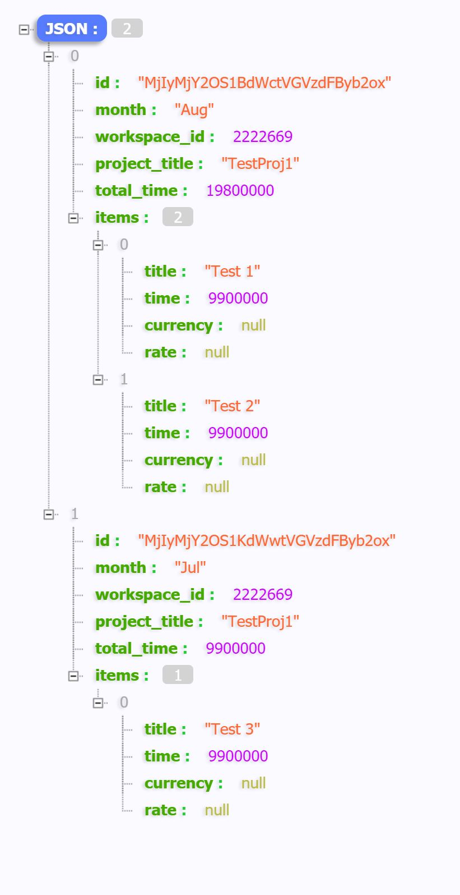
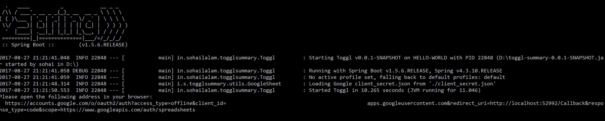
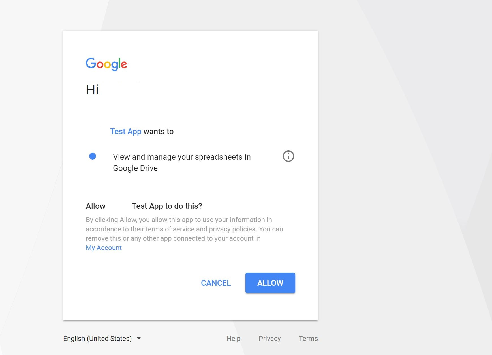
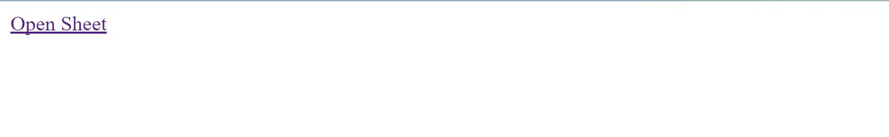
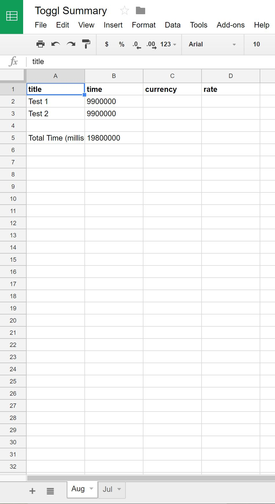

# Toggl Summary - Java SpringBoot
===

## Prerequisites 

- Java 1.8 or greater
- Toggl Account and API Token
- Google Account and Client Secret Json
- MongoDB

## How to Turn on the Google Sheets API from your Google Account
   
- Use **[this wizard](https://console.developers.google.com/start/api?id=sheets.googleapis.com)** to create or select a project in the Google Developers Console and automatically turn on the API. **Click Continue**, then **Go to credentials**.

- On the **Add credentials to your project page**, click the **Cancel** button.
 
- At the top of the page, select the **OAuth consent screen** tab. Select an **Email address**, enter a **Product name** if not already set, and click the **Save** button.

- Select the **Credentials** tab, click the **Create credentials** button and select **OAuth client ID**.

- Select the application type **Other**, enter the name "Toggl Summary Test", and click the **Create** button.

- Click **OK** to dismiss the resulting dialog.

- Click the **Download button** (Download JSON) to the right of the client ID.

- Move this file to your working directory and rename it client_secret.json.

## How to run the application jar

First make sure that MongoDB is running locally or externally. By default the application takes mongodb host as localhost, but you can change it as explained below.

From your terminal you can execute the jar file with some mandatory parameters as follows:

```sh
api_token=152d76f8d9a93fb0af75a456608edf37 \
client_secret="d:/client_secret.json" \
java -jar toggl-summary-0.0.1-SNAPSHOT.jar \
          --spring.data.mongodb.host=192.168.99.100
```

### Environment Variables (Mandatory)

The application expects the following environment variables

- **api_token** : The Toggl API Token
- **client_secret** : The Google Secret Json Path

### Application Parameters (Optional)

Optionally you could change the following application settings

- **--spring.data.mongodb.host**=MONGODB_HOSTNAME
- **--spring.data.mongodb.port**=MONGODB_PORT

## Usage and Screenshots
                 
The application will start at port 8080 and you can access the above endpoints as follows - 


### Import
                                                 
- HTTP GET /import - To import all your Toggl workspaces summary
- [http://localhost:8080/import](http://localhost:8080/import)

Once import is completed successfully (given that database is reachable), you should see a json response similar to this _(use google plugin such as JSON-handle to beautify the response)_- 



### Export

- HTTP GET /export - To export all your imported workspaces summary into Google spreadsheet
- [http://localhost:8080/export](http://localhost:8080/export)

The first time export is called, it will ask you to login to Google via a link that you can find in the console.



You should navigate to the given link and accept the dialog after logging into your google account.



When login is successful and export is done, you will see a link to the google spreadsheet




